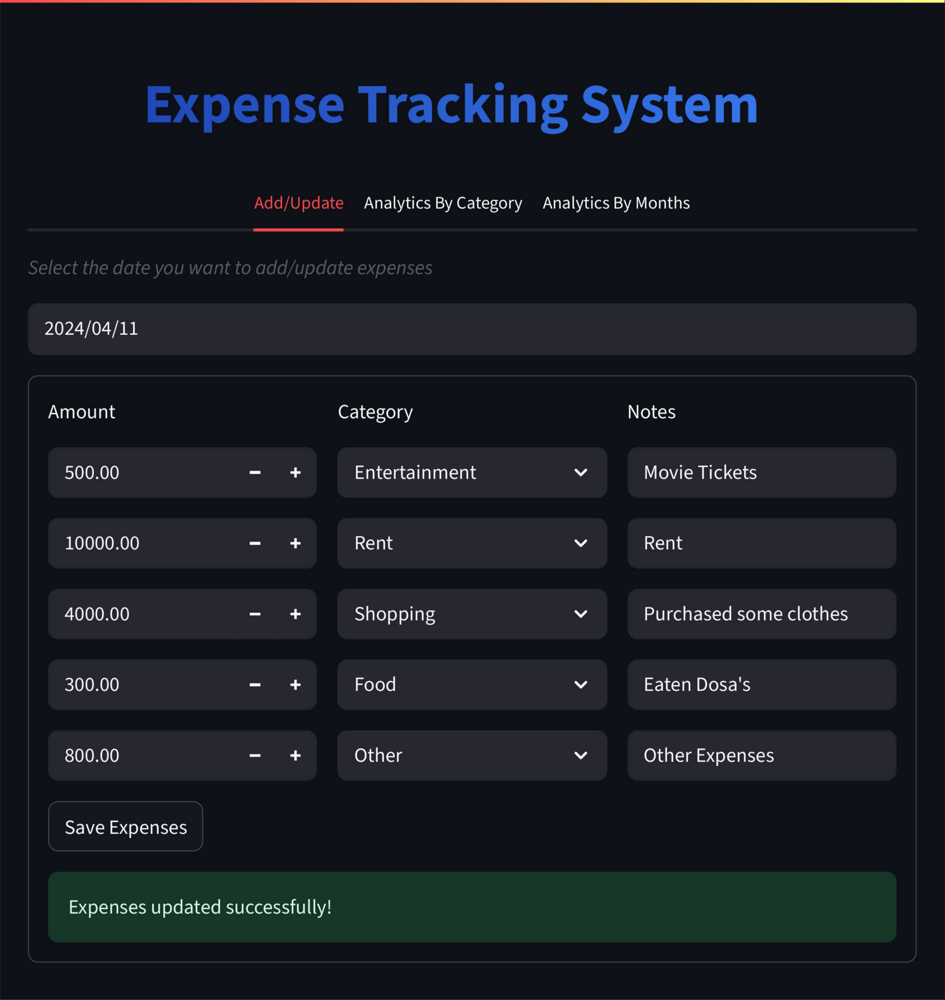

# Expense Management System

This project is an **Expense Management/Tracking System** consisting of a **Streamlit frontend** and a **FastAPI backend**. It allows users to track, add, and analyze their expenses by category and by month.

---

## Images

<table>
<tr>
<td></td>
<td></td>
</tr>
<tr>
<td></td>
<td></td>
</tr>
<tr>
<td></td>
<td></td>
</tr>
</table>


---

## Features

- Add and update daily expenses.
- View analytics by category (with charts and tables).
- View monthly expense summaries.
- Styled tables and charts for better visualization.
- Persistent storage using a FastAPI backend with a MySQL database.

---

## Project Structure
<pre><code>expense-management-system/
├── frontend/ # Streamlit frontend application
│   ├── app.py
│   ├── add_update.py
│   ├── analytics_by_category.py
│   └── analytics_by_months.py
│
├── backend/ # FastAPI backend server
│   ├── server.py
│   └── db_helper.py
│
├── tests/ # Test cases for frontend and backend
│
├── requirements.txt # Python dependencies
└── README.md # Project overview and setup instructions
</code></pre>

---

## Setup Instructions

### 1. Clone the repository
```bash
git clone https://github.com/yourusername/expense-management-system.git
cd expense-management-system
```

### 2. Install dependencies
```bash
pip install -r requirements.txt
```
### 3. Run the FastAPI backend
```bash
uvicorn backend.server:app --reload
```
### 4. Run the Streamlit frontend
```bash
streamlit run frontend/app.py
```
### Notes

- Ensure your MySQL database is running and accessible. Update credentials in db_helper.py if needed.

- Streamlit frontend communicates with FastAPI backend at http://localhost:8000 by default.

- Charts and tables are interactive and styled for readability.

### Inquiry
- workmail.darsh@gmail.com
